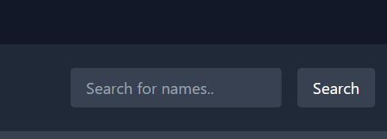

How to setup
1) Fork and git clone 
2) cd into Leaderboard directory
3) npm install i guess
4) node index.js to run the backend
5) in new window of vs code open frontend directory
6) start live server of index.html file

Feel free to create an issue or google/chatgpt if you get an error while setting up

1- Added Search Feature according to it changes username

2- Added chart that show no of student in each section

